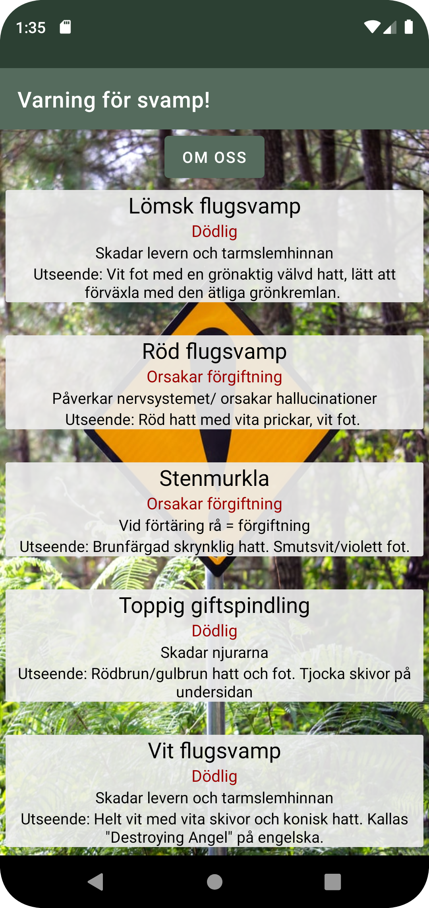
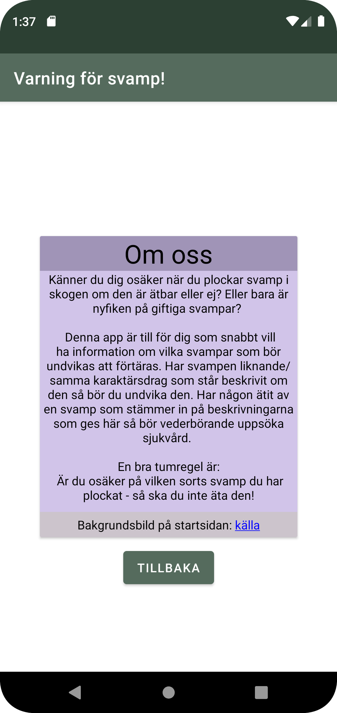

# Rapport

Jag valde att skapa en app som presenterar information om giftiga/dödliga svampar som finns i Sverige. 
Syftet med appen är att tillhandahålla en kort men informativ beskrivning om svamparnas utseende samt följder om dessa förtärs.

JSON-datan som hämtas och presenteras i min app är en arrray som innehåller 5 olika JSON-objekt med ett antal attribut.
Jag valde att använda attributen "ID", "name", "type", "location", "category" och "auxdata", där "ID" och "type" krävdes för uppgiften.  

I figur 1 visas ett av JSON-objekten upp. Jag valde att placera data om svampens namn i "name"-attributet och en längre beskrivande text i "auxdata".
Jag ville ha med information om svamparnas giftighet/dödligthet plus hur kroppen kan påverkas efter förtäring.
Jag analyserade namnen på attributen vi kunde använda och räknade då bort attributen "size" och "cost"
då jag misstänker att de är av datatypen int. 
Figur 1
```
{"ID":"svamp_lomFlug", 
"name":"Lömsk flugsvamp",
"type":"b21emmbj",
"company":"",
"location":"Dödlig",
"category":"Skadar levern och tarmslemhinnan",
"size":0,
"cost":0,
"auxdata":"Utseende: Vit fot med en grönaktig välvd hatt, lätt att förväxla med den ätliga grönkremlan."}
```

I förra uppgiften (Assignment 5: Networking) så använde jag mig av en constructor för att "uppdatera" datan i adaptern
men i detta projekt lärde jag mig att använda en "setter" istället. Denna metod visas i figur 2 och koden är skriven i filen Myadapter.java. 

Figur 2
```
   public void setSvamps(List<Svamp> svamps) {
        this.svamps = svamps;
    }
```

I figur 3 så tar jag med den kod som krävdes för att hämta och kunna använda datan från webtjänsten genom 
att konventera JSON-datan till Java objekt, allt detta görs i filen MainActivity.java. 
I figur 3 finns även hur jag gör kopplingen mellan RecyclerView, adapter och datan (från webtjänsten). 
Denna del i uppgiften upplevde jag som svårast då jag inte finner Java lika "förklarande eller självklart" som C++ och 
jag behövde läsa på flera gånger för att komma ihåg vilka delar som krävs för att det ska fungera.

Figur 3
```
    private final String JSON_URL = "https://mobprog.webug.se/json-api/getdataasjson.php?type=b21emmbj";
    private List<Svamp> listofSvampar;
    private Myadapter adapter;
    ...
    protected void onCreate(Bundle savedInstanceState) {
        listofSvampar = new ArrayList<Svamp>();
        adapter = new Myadapter();
        recyclerView = findViewById(R.id.myRecycler);
        recyclerView.setLayoutManager(new LinearLayoutManager(this));
        recyclerView.setAdapter(adapter);
        new JsonTask(this).execute(JSON_URL);
    ...
    public void onPostExecute(String json) {
        Gson gson = new Gson();
        Type type = new TypeToken<ArrayList<Svamp>>() {}.getType();
        listofSvampar = gson.fromJson(json, type);
        adapter.setSvamps(listofSvampar);
        adapter.notifyDataSetChanged();
    }
```

När jag var färdig med min app så ville jag lära mig hur man gör länkar till andra sidor. Jag använde mig av en 
bakgrundsbild i min app så jag ville skapa en länk för att referera till vart jag hittade den. Denna del var en av de roligare upplevelserna jag hade under utvecklingen av appen.
Jag tror det beror på att jag var färdig till den nivån jag var nöjd med av appen och hade tid över att utforska och lära mig saker på egen hand. 

Så i figur 4 visar jag upp hur jag löste det genom att ange URL;en med en "a-tagg" (HTML / anchor tag) i en sträng och sen 
i aktiviteten (SecondActivity) möjliggöra länken klickbar genom att använda setMovementMethod() på den TextView(n) som strängen finns i. 

Figur 4
```
...// från res/values/string.xml
    <string name="hyperLink">Bakgrundsbild på startsidan: <a href="https://unsplash.com/photos/4eeG4Mn0HVY">källa</a></string>
...
   // från SecondActivity.java
    private void setupHyperLink() {
        TextView linkTextView = findViewById(R.id.img_source);
        linkTextView.setMovementMethod(LinkMovementMethod.getInstance());
        linkTextView.setLinkTextColor(Color.BLUE);
    }
```

#Skärmbilder av min app:

## Huvudskärmen


## Skärmbild från andra aktiviteten ("Om oss")


